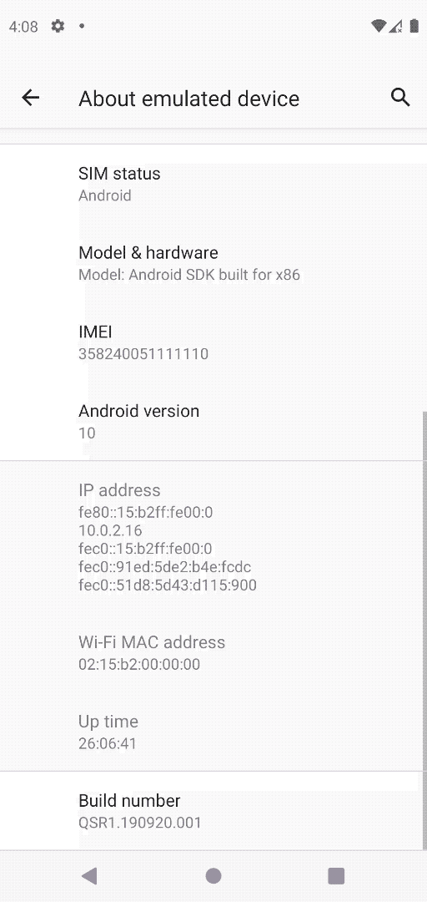

# StrandHogg attack recents

  

## App under attack
- `android:launchMode="singleTask"`

## Attacker app
- `android:launchMode="singleTask"`
- `android:taskAffinity="com.example.appunderattack"`
- `android:excludeFromRecents="true"`
- `moveTaskToBack(true)`

## Reproduction case
1. Device running Android 10 or lower
1. Open App under attack via icon
1. Press Android home button
1. Open Attacker app (nothing shown)
1. Open task switcher and select App under attack from recents
1. Attacker app displays activity on top
